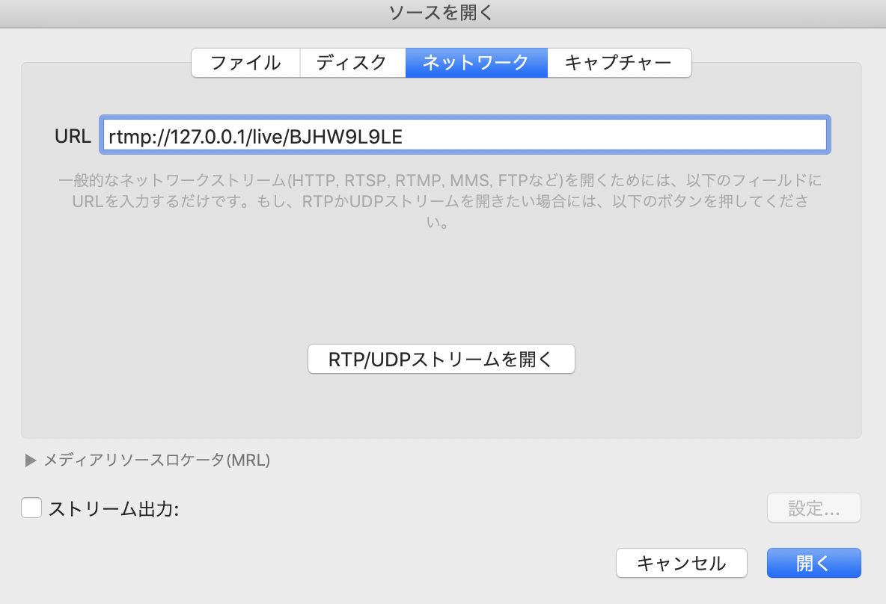

# BroadcastScratch
Sample of VideoCast-Swift and HaishinKit.

## Preparation

### Overview


### Steps

#### 1 Install [local rtmp server tool](https://github.com/sallar/mac-local-rtmp-server).


#### 2 Install [VLC Player](https://www.videolan.org/vlc/download-macosx.html).


#### 3 Build this project, setting your local rtmp server ip address. In my case,
```Swift
struct Config {
    private static let ip: String = "172.22.179.179"
    static let streamUrl: String = "rtmp://\(ip)/live"
    static let streamKey: String = "BJHW9L9LE"
}
```

#### 4 Launch local rtmp server and start broadcasting using VideoCast-Swift or HaishinKit.

**Not connecting status**


**Connecting status**


#### 5 Play via VLC



## Setup
```
bundle install
bundle exec pod install
```
